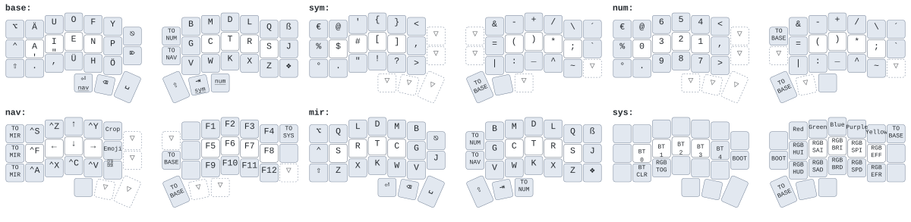

# Origin

The letter distribution is based on [Snug](https://github.com/mndscp/snug-keyboard-layout). I mirrored it since I have a permanent tendon injury on my right pinky, and the right hand sees much more action in the original layout. I also moved `J` to the other side and added dedicated `ÄÖÜß` keys in what seemed like the most suitable spots. In my opinion, the `Ö` is the only problematic one, but given that I wanted to reserve the left outer column for control keys that are used with the mouse a lot, I couldn't come up with a better configuration and I believe the current spot is the best compromise overall.

The layers apart from `BASE` I created completely from scratch without any templates at all. `SYM` and `NUM` are intended for general coding in no specific languages, as well as typst/LaTeX markdown format.

I did 99% of the coding in Antigravity IDE, which saved me many hours of skimming through documentations for the more intricate details and especially for the renderings. Nickcoutsos editor works well enough but is still a pain to use given the lack of any kind of drag-and-drop functionality.

# Features

 - Hold-taps for `Enter` and `Tab` on thumb keys.
 - Layer-locks for `NUM` and `SYM` on the right inner column.
 - Identical `NUM` and `SYM` (apart from the number area) that allows for most mathematical expressions to be typed with only `NUM` and not switching back and forth to `SYM`.
 - On `NAV`, the left outer column becomes a `&to` key to `MIR`. This layer contains the mirrored letters of the right half on the left half, and all keys except the left outer column use the custom `&kpb` (keypressback) behavior that returns to the base layer after press. This allows access with the left hand only to all letters and all key combinations. One of my common use cases is `ctrl D` which is "duplicate" in InkScape, and which would be awkward to use while also working with the mouse.
 - `SYS` can be accessed by the top key in the left outer column combined with `NAV`. This is intentionally awkward to avoid accidental triggers.
 - There is no layer-lock for `SYM` since I couldn't think of any realistic use-case.
 - `shift` is a general way out of all layer-locks and returns to the base layer.

